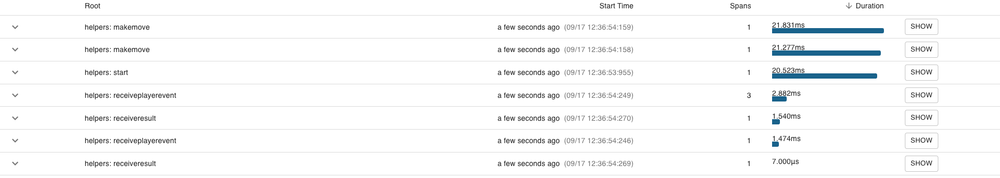

The idea is the same, but this time the application is no longer a monolith but split into three different services: GameService, CopyPlayerService and RandomPlayerService.

These three services are communicating through a RabbitMQ-based message broker.

To get the application up and running you should do the following:

1. Run docker compose up -d in your command line. This will spin up containers for RabbitMQ, Zipkin and Seq. 
2. Open http://localhost:15672 and login with username application and password pepsi. This will give you access to the RabbitMQ management interface. You should not need to change anything inhere. 
3. Open http://localhost:9411 to get access to the Zipkin instance. 
4. Open http://localhost:5342 to get access to the Seq instance. 
5. Run the CopyPlayerService, RandomPlayerService and finally the GameMasterService locally from your own computer (no containers). The first time you run the services the mentioned order of execution is important to instantiate RabbitMQ correctly.
If you query Zipkin now, you will see something similar to this:

All these traces are basically the same operation, but since multiple services are involved the operation is split into multiple traces.

Implement the concepts from this weeks materials.